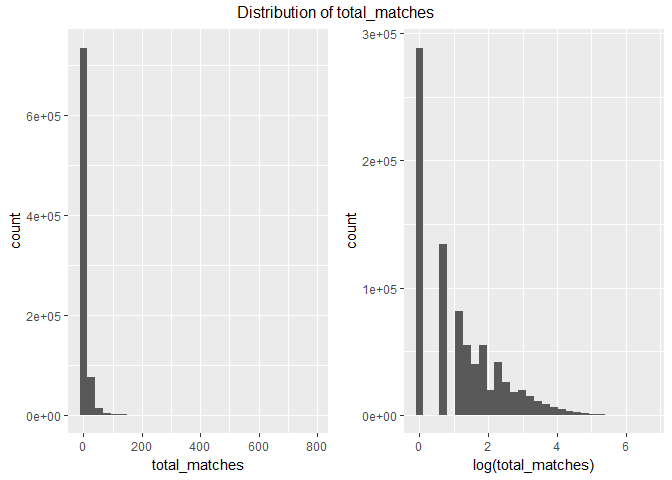
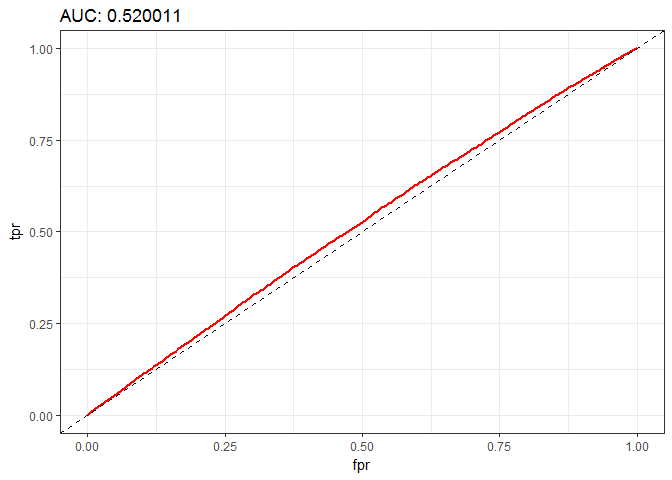
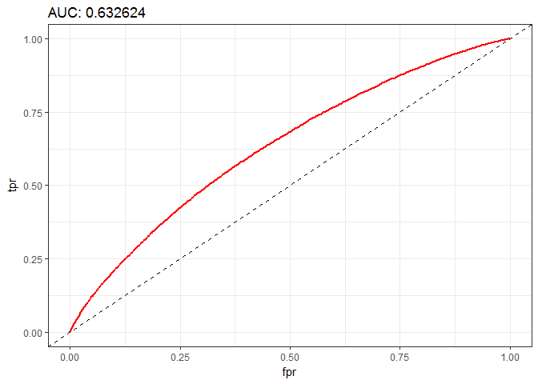
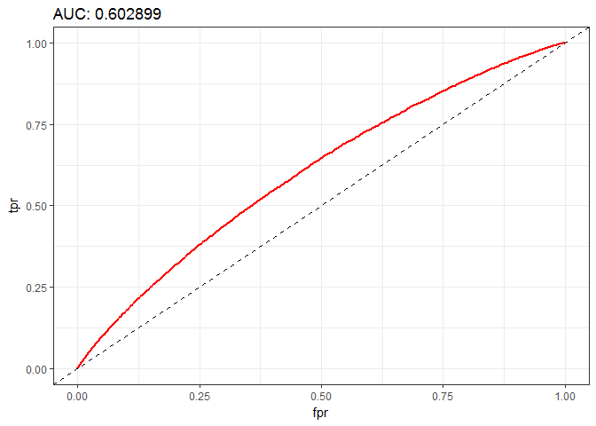
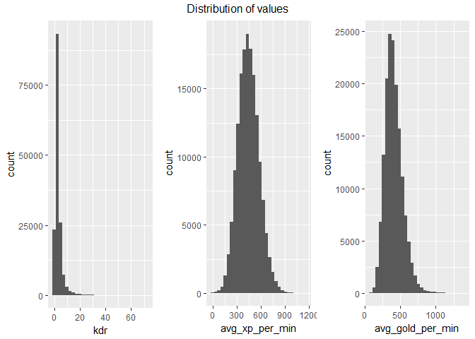
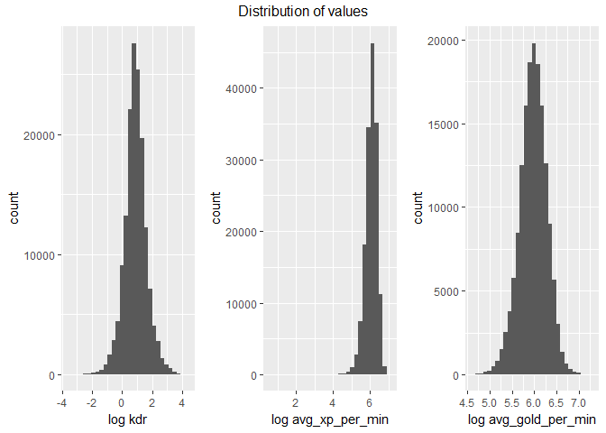
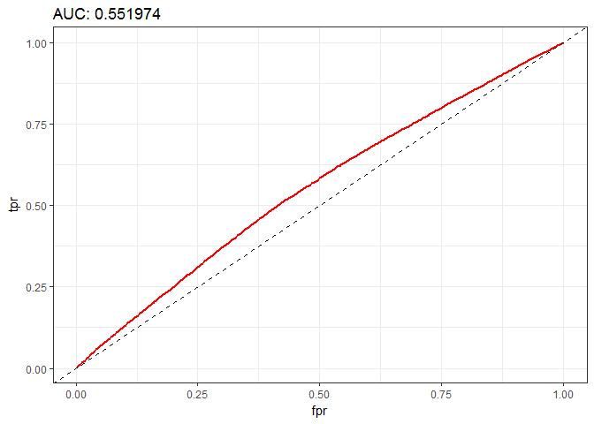
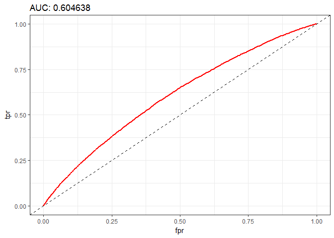

Predicting DOTA match results
=============================

Background
==========

DOTA or more specifically DOTA 2 is an online MOBA (Massive online
battle arena) game developed and hosted by Valve Corporation. Dota 2 has
a widespread and active competitive scene, with teams from across the
world playing professionally in various dedicated leagues and
tournaments. Premium Dota 2 tournaments often have prize pools totaling
millions of US dollars, the highest of any eSport.

In DOTA there are two opposing teams called Radiant and Dire trying to
destroy the opposing team's base. During the game the players collecting
experience points to level up and gain additional skills and also gold
to buy equipment. Additional details can be found here:
[Wikipedia](https://en.wikipedia.org/wiki/Dota_2), [DOTA 2
Wiki](http://dota2.gamepedia.com/Dota_2_Wiki)

Goal
====

The goal of this experiment is to find a model that could estimate the
outcome of a DOTA 2 match based only on the participating players and
their stats/history and on the information that is available only at the
beginning of the matches.

Getting data
------------

Data was downloaded from
<https://www.kaggle.com/devinanzelmo/dota-2-matches> The downloaded
[data](https://www.kaggle.com/devinanzelmo/dota-2-matches/downloads/dota-2-matches.zip)
has to be extracted to a *data* folder in the working directory.

The data consists multiple files but only some of them were used. Please
find detailed description below.

Exploring data
--------------

    library(readr)
    library(data.table)
    library(reshape2)
    library(dplyr)
    library(h2o)
    library(ggplot2)
    library(gridExtra)

    localH2O = h2o.init(nthreads=-1)

    ##  Connection successful!
    ## 
    ## R is connected to the H2O cluster: 
    ##     H2O cluster uptime:         2 hours 31 minutes 
    ##     H2O cluster version:        3.10.3.4 
    ##     H2O cluster version age:    1 month and 16 days  
    ##     H2O cluster name:           H2O_started_from_R_Janos_Strasszer_cvj821 
    ##     H2O cluster total nodes:    1 
    ##     H2O cluster total memory:   3.15 GB 
    ##     H2O cluster total cores:    4 
    ##     H2O cluster allowed cores:  4 
    ##     H2O cluster healthy:        TRUE 
    ##     H2O Connection ip:          localhost 
    ##     H2O Connection port:        54321 
    ##     H2O Connection proxy:       NA 
    ##     R Version:                  R version 3.3.2 (2016-10-31)

### match.csv variables

Match contains all the high level statistics of the match like the
status of the towers at the end of the match and more importantly the
outcome. Most if these variables should be dropped because most of them
are not available before the matches.

The few exceptions:

**game\_mode:**

    match <- data.table(read_csv("data/match.csv"))
    nrow(match)

    ## [1] 50000

    match[, .N, by=game_mode]

    ##    game_mode     N
    ## 1:        22 48670
    ## 2:         2  1330

The two possible values for *game\_mode* are the same from the aspect of
game mechanics. Both (2-Captain Mode, 22-Ranked Matchmaking) are
consists of a *banning phase* followed by *all pick* --&gt; Feature will
be removed.

**start\_time:** It is irrelevant --&gt; Will be removed.

**radiant\_win:** Indicates whether the *Radiant* or the *Dire* team won
the match. It will be converted to a binary variable: 1-Radiant, 0-Dire
win.

**match\_id:** should be kept to identify the match.

Finalize match outcome df:

    # Training outcome
    match <- match[, list(match_id,radiant_win)]
    match[, winner:= as.factor(if_else(radiant_win == "True", true = "RADIANT", false = "DIRE"))]

    ##        match_id radiant_win  winner
    ##     1:        0        True RADIANT
    ##     2:        1       False    DIRE
    ##     3:        2       False    DIRE
    ##     4:        3       False    DIRE
    ##     5:        4        True RADIANT
    ##    ---                             
    ## 49996:    49995        True RADIANT
    ## 49997:    49996        True RADIANT
    ## 49998:    49997        True RADIANT
    ## 49999:    49998        True RADIANT
    ## 50000:    49999       False    DIRE

    match$radiant_win <- NULL
    ranked_match_outcome_train <- match
    rm(match)

    # Test outcome
    ranked_match_outcome_test <- data.table(read_csv("data/test_labels.csv"))
    ranked_match_outcome_test[, winner:=as.factor(if_else(radiant_win == 1, true = "RADIANT", false = "DIRE"))]

    ##         match_id radiant_win  winner
    ##      1:    50000           0    DIRE
    ##      2:    50001           1 RADIANT
    ##      3:    50002           0    DIRE
    ##      4:    50003           1 RADIANT
    ##      5:    50004           0    DIRE
    ##     ---                             
    ##  99996:   149995           1 RADIANT
    ##  99997:   149996           1 RADIANT
    ##  99998:   149997           1 RADIANT
    ##  99999:   149998           1 RADIANT
    ## 100000:   149999           0    DIRE

    ranked_match_outcome_test$radiant_win <- NULL

**test\_labels.csv** has a similar structure but only contains the
outcome of the matches. It is ideal to be used as validation data.

### player\_rating.csv variables

    legacy_player_ratings <- data.table(read_csv("data/player_ratings.csv"))
    nrow(legacy_player_ratings)

    ## [1] 834226

**total\_wins:** The total number of wins the player has.

**total\_matches:** The total number of matches the player played.

### players.csv

Contains player information for the matches: What player played what
hero in what slot. Also there are a tons of performance indicators that
won't be listed here but later during the experiments. For more
information please check the data description on Kaggle.

test\_player.csv has similar information but without the performance
indicators thus it is ideal to be used as validation data.

Experiment 1
============

In the first experiment only the average player winrate per team will be
used as feature in the prediction.

    # Player ratings can be calculated from 900K historical matches
    legacy_player_ratings[, win_percent:=total_wins/total_matches]

    ##         account_id total_wins total_matches trueskill_mu trueskill_sigma
    ##      1:     236579         14            24     27.86804        5.212361
    ##      2:       -343          1             1     26.54416        8.065475
    ##      3:      -1217          1             1     26.52110        8.114989
    ##      4:      -1227          1             1     27.24802        8.092217
    ##      5:      -1284          0             1     22.93102        8.092224
    ##     ---                                                                 
    ## 834222: -298722891          1             1     27.64315        8.013786
    ## 834223:     106173          0             1     23.06938        7.998792
    ## 834224:     312076          1             1     28.21708        7.889176
    ## 834225: -299193988          0             2     22.40614        7.851303
    ## 834226:          0    1608398       3315071     25.00000        8.333333
    ##         win_percent
    ##      1:   0.5833333
    ##      2:   1.0000000
    ##      3:   1.0000000
    ##      4:   1.0000000
    ##      5:   0.0000000
    ##     ---            
    ## 834222:   1.0000000
    ## 834223:   0.0000000
    ## 834224:   1.0000000
    ## 834225:   0.0000000
    ## 834226:   0.4851775

    # Imputing missing data: if there is no stat for the player, lets asume he is an average player (id 0 is for the average)
    unidentified_win_percent <- legacy_player_ratings[account_id==0, win_percent]

    # Each row represents a player in a match thus 10 rows represents a match
    players_train <- data.table(read_csv("data/players.csv"))
    players_test <- data.table(read_csv("data/test_player.csv"))

    feature1 <- function(legacy_player_ratings, players, outcome, imputed_win_percent) {
      playerdata <- data.table(left_join(players, legacy_player_ratings[, c("account_id", "win_percent")],
                              by=c("account_id" = "account_id")))
      playerdata[is.na(win_percent), win_percent:=unidentified_win_percent]
      
      # player_slot 0-4: radiant, 128-132: dire
      playerdata[, side:= as.factor(if_else(player_slot < 100, true = "RADIANT", false = "DIRE"))]
      
      teamstat <- playerdata%>% group_by(match_id, side) %>% summarise(win_percent_legacy=mean(win_percent))
      teamstat <- left_join(teamstat[teamstat$side == "RADIANT", c("match_id", "win_percent_legacy")],
                      teamstat[teamstat$side == "DIRE", c("match_id", "win_percent_legacy")],
                      by="match_id", suffix=c("_RADIANT", "_DIRE"))
      out <- left_join(outcome, teamstat, by="match_id")
      
      return(out)
    }

    train <- feature1(legacy_player_ratings, players_train, ranked_match_outcome_train, unidentified_win_percent)
    test <- feature1(legacy_player_ratings, players_test, ranked_match_outcome_test, unidentified_win_percent)

Try to do the analysis

    upload_data <- function(up_train, up_test) {
      if(exists("h_train")) {
        h2o.rm(h_train)
      }
      if(exists("h_test")) {
        h2o.rm(h_test)
      }
      h_train <<- as.h2o(up_train)
      h_test <<- as.h2o(up_test)
    }

    upload_data(train, test)

    linear_model <- h2o.glm(x = c("win_percent_legacy_RADIANT", "win_percent_legacy_DIRE"), y = "winner",
                      training_frame = h_train, validation_frame = h_test,
                      family = "binomial",
                      score_each_iteration = TRUE)

    model_performance <- function(model) {
      auc <- h2o.auc(model, valid = TRUE)
      fpr <- h2o.fpr( h2o.performance(model, valid = TRUE) )[['fpr']]
      tpr <- h2o.tpr( h2o.performance(model, valid = TRUE) )[['tpr']]
      ggplot( data.table(fpr = fpr, tpr = tpr), aes(fpr, tpr) ) + 
        # geom_area(fill="#FCEBED") +
        geom_line(colour="red", size = 1) +
        geom_abline(linetype="dashed") +
        theme_bw() +
        ggtitle( sprintf('AUC: %f', auc) )
    }

    model_performance(linear_model)

    h2o.confusionMatrix(linear_model, newdata = h_test)

    ## Confusion Matrix for max f1 @ threshold = 0.448915207674831:
    ##         DIRE RADIANT    Error          Rate
    ## DIRE       3   48136 0.999938  =48136/48139
    ## RADIANT    1   51860 0.000019      =1/51861
    ## Totals     4   99996 0.481370  =48137/1e+05

Ok. It is only a slight better than pure guessing. From my own playing
experience I know that in this game playing more matches are very
important. Adding this kind of information as a feature may have a
positive effect on the guessing.

Experiment 2
============

In the second experiment the number of total matches the players played
will be added as feature alongside with the averages too.

    # In player ratings for account 0 (all of unidentified accounts) the number of matches are not for one player but all of the unidentified players. Also there are missing values. This will be corrected to use an average.
    avg_legacy_match_count <- as.integer(round(mean(as.numeric(legacy_player_ratings[legacy_player_ratings$account_id != 0, "total_matches"]$total_matches))))
    legacy_player_ratings[legacy_player_ratings$account_id == 0 | is.na(legacy_player_ratings$account_id), "total_matches"] <- avg_legacy_match_count

    # Distribution of value:
    p1 <- ggplot(data = legacy_player_ratings) + geom_histogram(aes(x = total_matches))
    p2 <- ggplot(data = legacy_player_ratings) + geom_histogram(aes(x = log(total_matches)))

    grid.arrange(p1, p2, ncol=2, top = "Distribution of total_matches")

According to the histograms taking logs is a good idea in this case. The
distribution is still far from Gaussian but looks more usable.

    feature2 <- function(legacy_player_ratings, players, feature1, avg_legacy_match_count) {
      playerdata <- data.table(left_join(players_train, legacy_player_ratings[,.(account_id, total_matches)], by = "account_id"))
      playerdata[is.na(total_matches), total_matches:=avg_legacy_match_count]
      
      # player_slot 0-4: radiant, 128-132: dire
      playerdata[, side:= as.factor(if_else(player_slot < 100, true = "RADIANT", false = "DIRE"))]
      
      teamstat <- playerdata %>% group_by(match_id, side) %>% summarise(ln_avg_matches_legacy=log(mean(total_matches)), ln_total_matches_legacy=log(sum(total_matches)))
      
      teamstat_join_columns <- c("match_id", "ln_avg_matches_legacy", "ln_total_matches_legacy")
      teamstat <- left_join(teamstat[teamstat$side == "RADIANT", teamstat_join_columns],
                      teamstat[teamstat$side == "DIRE", teamstat_join_columns],
                      by="match_id", suffix=c("_RADIANT", "_DIRE")
                  )
      out <- left_join(feature1, teamstat, by="match_id")
      
      return(out)
    }

    train <- feature2(legacy_player_ratings, players_train, train, avg_legacy_match_count)
    test <- feature2(legacy_player_ratings, players_test, test, avg_legacy_match_count)

    upload_data(train, test)

    linear_model <- h2o.glm(x = c(
      "win_percent_legacy_RADIANT",
      "win_percent_legacy_DIRE",
      "ln_avg_matches_legacy_RADIANT",
      "ln_avg_matches_legacy_DIRE",
      "ln_total_matches_legacy_RADIANT",
      "ln_total_matches_legacy_DIRE"),
      y = "winner",
      training_frame = h_train, validation_frame = h_test,
      family = "binomial",
      score_each_iteration = TRUE)

    model_performance(linear_model)

    h2o.confusionMatrix(linear_model, newdata = h_test)

    ## Confusion Matrix for max f1 @ threshold = 0.471339903330327:
    ##         DIRE RADIANT    Error          Rate
    ## DIRE       3   48136 0.999938  =48136/48139
    ## RADIANT    1   51860 0.000019      =1/51861
    ## Totals     4   99996 0.481370  =48137/1e+05

Unfortunately the prediction accuracy didn't increase. We have to find
new ways to improve the accuracy.

Experiment 3
============

Actually the real game begins at character selection. A good combination
of the heroes can lead to victory even for weaker players too. All the
heroes will be added as a binary indicator variable. (Hero ids: \[1,
113\])

As the linear model starting to become more complicated a random forest
model will be evaluated too. Random forest can provide a good output
with minimal effort and it is resilient to over-fitting.

    feature3 <- function(players, feature2) {
      herodata <- players[, list(match_id, player_slot, hero_id)]
      melted <- melt(herodata, id.vars = c("match_id", "player_slot"))
      melted[, variable:=as.factor(paste(ifelse(player_slot < 100, "RADIANT", "DIRE"), "hero", value, sep = "_"))]
      melted[, value:=1]
      herodata <- dcast(melted, match_id ~ variable)

      out <- left_join(feature2, herodata, by="match_id")
      
      return(out)
    }

    train <- feature3(players_train, train)
    test <- feature3(players_test, test)

    upload_data(train, test)

    linear_model <- h2o.glm(
      x = colnames(train)[3:length(colnames(train))],
      y = "winner",
      training_frame = h_train, validation_frame = h_test,
      family = "binomial",
      score_each_iteration = TRUE)

    model_performance(linear_model)

    h2o.confusionMatrix(linear_model, newdata = h_test)

    ## Confusion Matrix for max f1 @ threshold = 0.338317623250638:
    ##         DIRE RADIANT    Error          Rate
    ## DIRE    4303   43836 0.910613  =43836/48139
    ## RADIANT 1808   50053 0.034862   =1808/51861
    ## Totals  6111   93889 0.456440  =45644/1e+05

    random_forest <- h2o.randomForest(
      x = colnames(train)[3:length(colnames(train))],
      y = "winner",
      training_frame = h_train, validation_frame = h_test
      # score_each_iteration = TRUE
      )

    model_performance(random_forest)

    h2o.confusionMatrix(random_forest, newdata = h_test)

    ## Confusion Matrix for max f1 @ threshold = 0.413738227358363:
    ##         DIRE RADIANT    Error          Rate
    ## DIRE    1764   46375 0.963356  =46375/48139
    ## RADIANT  783   51078 0.015098    =783/51861
    ## Totals  2547   97453 0.471580  =47158/1e+05

The theory was confirmed: Adding information of hero selection increased
the AUX about 11 percentage points for linear model. Random forest
didn't performed that well as the linear model but using the new
features it was still better than the linear model previously.

Experiment 4
============

The following player stats will be calculated from ranked match data to
have a detailed information regarding the individual player skill:

-   Kill death ratio (kdr) : An important statistics that shows the
    players skill. Unfortunately only killing blows count as kills
    therefore this ratio will be adjusted by counting assists (when the
    player participated in the kill but an other player got the
    actual kill)

-   Average XP/min : Higher value means that the player participated in
    fights more actively and by acquiring more experience points he
    could level up faster. Level advantage is a decision maker
    between win/lose.

-   Average Gold/min : Higher value means that the player was able to
    have more lat hits (That earns golds) or was able to destroy
    enemy structures. With more gold the player could buy more advanced
    items and this is improving his team's chance to win.

These player performance indicators will be assigned to the
corresponding player slot instead using simple averages. As an
expectation it will add better control for players with exceptional
skills because this kind of players can carry the match and win it. As
usual account\_id 0 is for unidentified players. The average values of
all unidentified players imputed here.

    player_stat_rated <- players_train %>% group_by(account_id) %>%
      summarise(kdr=(sum(kills)+sum(assists))/sum(deaths), avg_xp_per_min=mean(xp_per_min), avg_gold_per_min=mean(gold_per_min))

    # Distribution of values:
    distplot <- function(dat, label_prefix) {
      p1 <- ggplot(data = dat) + geom_histogram(aes(x = kdr)) + xlab(paste(label_prefix, "kdr", sep = ""))
      p2 <- ggplot(data = dat) + geom_histogram(aes(x = avg_xp_per_min)) + xlab(paste(label_prefix, "avg_xp_per_min", sep = ""))
      p3 <- ggplot(data = dat) + geom_histogram(aes(x = avg_gold_per_min)) + xlab(paste(label_prefix, "avg_gold_per_min", sep = ""))

      grid.arrange(p1, p2, p3, ncol = 3, top = "Distribution of values")
    }

    distplot(player_stat_rated, "")

Kdr and avg\_gold\_per\_min shows a right tail and also we are going for
differences here rather than levels thus taking logs should be
beneficial.

    player_stat_rated$kdr <- log(player_stat_rated$kdr)
    player_stat_rated$avg_xp_per_min <- log(player_stat_rated$avg_xp_per_min)
    player_stat_rated$avg_gold_per_min <- log(player_stat_rated$avg_gold_per_min)

    distplot(player_stat_rated, "log ")

    feature4 <- function(players, feature3) {
      herodata <- players[, list(match_id, player_slot, account_id)]
      melted <- melt(herodata, id.vars = c("match_id", "player_slot"))
      melted <- data.table(left_join(melted, player_stat_rated, by=c("value" = "account_id")))
      melted[, variable:=as.factor(paste(ifelse(player_slot < 100, "RADIANT", "DIRE"), "kdr", player_slot %% 128, sep = "_"))]
      melted$value <- melted$kdr
      herodata1 <- dcast(melted, match_id ~ variable)
      melted[, variable:=as.factor(paste(ifelse(player_slot < 100, "RADIANT", "DIRE"), "avg_xp_per_min", player_slot %% 128, sep = "_"))]
      melted$value <- melted$avg_xp_per_min
      herodata2 <- dcast(melted, match_id ~ variable)
      melted[, variable:=as.factor(paste(ifelse(player_slot < 100, "RADIANT", "DIRE"), "avg_gold_per_min", player_slot %% 128, sep = "_"))]
      melted$value <- melted$avg_gold_per_min
      herodata3 <- dcast(melted, match_id ~ variable)
      
      herodata <- left_join(herodata1, herodata2, by="match_id")
      herodata <- left_join(herodata, herodata3, by="match_id")
     
      out <- left_join(feature3, herodata, by="match_id")
       
      return(out)
    }

    train_2 <- feature4(players_train, train)
    test_2 <- feature4(players_test, test)

    upload_data(train_2, test_2)

    linear_model <- h2o.glm(
      x = colnames(train_2)[3:length(colnames(train_2))],
      y = "winner",
      training_frame = h_train, validation_frame = h_test,
      family = "binomial",
      score_each_iteration = TRUE)

    model_performance(linear_model)

    h2o.confusionMatrix(linear_model, newdata = h_test)

    ## Confusion Matrix for max f1 @ threshold = 0.00117918782384543:
    ##         DIRE RADIANT    Error          Rate
    ## DIRE       0   48139 1.000000  =48139/48139
    ## RADIANT    0   51861 0.000000      =0/51861
    ## Totals     0  100000 0.481390  =48139/1e+05

    gb_model <- h2o.gbm(
      x = colnames(train)[3:length(colnames(train))],
      y = "winner",
      training_frame = h_train, validation_frame = h_test,
      score_each_iteration = TRUE)

    model_performance(gb_model)

    h2o.confusionMatrix(gb_model, newdata = h_test)

    ## Confusion Matrix for max f1 @ threshold = 0.417290973476894:
    ##         DIRE RADIANT    Error          Rate
    ## DIRE    2655   45484 0.944847  =45484/48139
    ## RADIANT 1268   50593 0.024450   =1268/51861
    ## Totals  3923   96077 0.467520  =46752/1e+05

The AUC became worse by adding these features. It looks like the model
is starting to became more complicated and it is starting to overfit.
**The previous feature set will be used for final evaluation.
(Experiment 3)**

Conclusion
==========

Several different model with different parameters (GBM, Random Forest,
Neural Network) have been tested using the H\_2\_O Flow UI but neither
of them provided the accuracy of the linear model used in *Experiment
3*: **Experiment 3** results:

    upload_data(train, test)

    linear_model <- h2o.glm(
      x = colnames(train)[3:length(colnames(train))],
      y = "winner",
      training_frame = h_train, validation_frame = h_test,
      family = "binomial",
      score_each_iteration = TRUE)

    model_performance(linear_model)

    h2o.confusionMatrix(linear_model, newdata = h_test)

    ## Confusion Matrix for max f1 @ threshold = 0.338317623250638:
    ##         DIRE RADIANT    Error          Rate
    ## DIRE    4303   43836 0.910613  =43836/48139
    ## RADIANT 1808   50053 0.034862   =1808/51861
    ## Totals  6111   93889 0.456440  =45644/1e+05

The final accuracy is 63% what is much better than random guessing and
it is a pretty good result considering the fact that the matches
organized by a ranking system that tryes to assign teams with similar
skill levels to a match.

#### Appendix: List of variables used in Experiment 3

    colnames(train)

    ##   [1] "match_id"                        "winner"                         
    ##   [3] "win_percent_legacy_RADIANT"      "win_percent_legacy_DIRE"        
    ##   [5] "ln_avg_matches_legacy_RADIANT"   "ln_total_matches_legacy_RADIANT"
    ##   [7] "ln_avg_matches_legacy_DIRE"      "ln_total_matches_legacy_DIRE"   
    ##   [9] "DIRE_hero_0"                     "DIRE_hero_1"                    
    ##  [11] "DIRE_hero_10"                    "DIRE_hero_100"                  
    ##  [13] "DIRE_hero_101"                   "DIRE_hero_102"                  
    ##  [15] "DIRE_hero_103"                   "DIRE_hero_104"                  
    ##  [17] "DIRE_hero_105"                   "DIRE_hero_106"                  
    ##  [19] "DIRE_hero_107"                   "DIRE_hero_109"                  
    ##  [21] "DIRE_hero_11"                    "DIRE_hero_110"                  
    ##  [23] "DIRE_hero_111"                   "DIRE_hero_112"                  
    ##  [25] "DIRE_hero_12"                    "DIRE_hero_13"                   
    ##  [27] "DIRE_hero_14"                    "DIRE_hero_15"                   
    ##  [29] "DIRE_hero_16"                    "DIRE_hero_17"                   
    ##  [31] "DIRE_hero_18"                    "DIRE_hero_19"                   
    ##  [33] "DIRE_hero_2"                     "DIRE_hero_20"                   
    ##  [35] "DIRE_hero_21"                    "DIRE_hero_22"                   
    ##  [37] "DIRE_hero_23"                    "DIRE_hero_25"                   
    ##  [39] "DIRE_hero_26"                    "DIRE_hero_27"                   
    ##  [41] "DIRE_hero_28"                    "DIRE_hero_29"                   
    ##  [43] "DIRE_hero_3"                     "DIRE_hero_30"                   
    ##  [45] "DIRE_hero_31"                    "DIRE_hero_32"                   
    ##  [47] "DIRE_hero_33"                    "DIRE_hero_34"                   
    ##  [49] "DIRE_hero_35"                    "DIRE_hero_36"                   
    ##  [51] "DIRE_hero_37"                    "DIRE_hero_38"                   
    ##  [53] "DIRE_hero_39"                    "DIRE_hero_4"                    
    ##  [55] "DIRE_hero_40"                    "DIRE_hero_41"                   
    ##  [57] "DIRE_hero_42"                    "DIRE_hero_43"                   
    ##  [59] "DIRE_hero_44"                    "DIRE_hero_45"                   
    ##  [61] "DIRE_hero_46"                    "DIRE_hero_47"                   
    ##  [63] "DIRE_hero_48"                    "DIRE_hero_49"                   
    ##  [65] "DIRE_hero_5"                     "DIRE_hero_50"                   
    ##  [67] "DIRE_hero_51"                    "DIRE_hero_52"                   
    ##  [69] "DIRE_hero_53"                    "DIRE_hero_54"                   
    ##  [71] "DIRE_hero_55"                    "DIRE_hero_56"                   
    ##  [73] "DIRE_hero_57"                    "DIRE_hero_58"                   
    ##  [75] "DIRE_hero_59"                    "DIRE_hero_6"                    
    ##  [77] "DIRE_hero_60"                    "DIRE_hero_61"                   
    ##  [79] "DIRE_hero_62"                    "DIRE_hero_63"                   
    ##  [81] "DIRE_hero_64"                    "DIRE_hero_65"                   
    ##  [83] "DIRE_hero_66"                    "DIRE_hero_67"                   
    ##  [85] "DIRE_hero_68"                    "DIRE_hero_69"                   
    ##  [87] "DIRE_hero_7"                     "DIRE_hero_70"                   
    ##  [89] "DIRE_hero_71"                    "DIRE_hero_72"                   
    ##  [91] "DIRE_hero_73"                    "DIRE_hero_74"                   
    ##  [93] "DIRE_hero_75"                    "DIRE_hero_76"                   
    ##  [95] "DIRE_hero_77"                    "DIRE_hero_78"                   
    ##  [97] "DIRE_hero_79"                    "DIRE_hero_8"                    
    ##  [99] "DIRE_hero_80"                    "DIRE_hero_81"                   
    ## [101] "DIRE_hero_82"                    "DIRE_hero_83"                   
    ## [103] "DIRE_hero_84"                    "DIRE_hero_85"                   
    ## [105] "DIRE_hero_86"                    "DIRE_hero_87"                   
    ## [107] "DIRE_hero_88"                    "DIRE_hero_89"                   
    ## [109] "DIRE_hero_9"                     "DIRE_hero_90"                   
    ## [111] "DIRE_hero_91"                    "DIRE_hero_92"                   
    ## [113] "DIRE_hero_93"                    "DIRE_hero_94"                   
    ## [115] "DIRE_hero_95"                    "DIRE_hero_96"                   
    ## [117] "DIRE_hero_97"                    "DIRE_hero_98"                   
    ## [119] "DIRE_hero_99"                    "RADIANT_hero_0"                 
    ## [121] "RADIANT_hero_1"                  "RADIANT_hero_10"                
    ## [123] "RADIANT_hero_100"                "RADIANT_hero_101"               
    ## [125] "RADIANT_hero_102"                "RADIANT_hero_103"               
    ## [127] "RADIANT_hero_104"                "RADIANT_hero_105"               
    ## [129] "RADIANT_hero_106"                "RADIANT_hero_107"               
    ## [131] "RADIANT_hero_109"                "RADIANT_hero_11"                
    ## [133] "RADIANT_hero_110"                "RADIANT_hero_111"               
    ## [135] "RADIANT_hero_112"                "RADIANT_hero_12"                
    ## [137] "RADIANT_hero_13"                 "RADIANT_hero_14"                
    ## [139] "RADIANT_hero_15"                 "RADIANT_hero_16"                
    ## [141] "RADIANT_hero_17"                 "RADIANT_hero_18"                
    ## [143] "RADIANT_hero_19"                 "RADIANT_hero_2"                 
    ## [145] "RADIANT_hero_20"                 "RADIANT_hero_21"                
    ## [147] "RADIANT_hero_22"                 "RADIANT_hero_23"                
    ## [149] "RADIANT_hero_25"                 "RADIANT_hero_26"                
    ## [151] "RADIANT_hero_27"                 "RADIANT_hero_28"                
    ## [153] "RADIANT_hero_29"                 "RADIANT_hero_3"                 
    ## [155] "RADIANT_hero_30"                 "RADIANT_hero_31"                
    ## [157] "RADIANT_hero_32"                 "RADIANT_hero_33"                
    ## [159] "RADIANT_hero_34"                 "RADIANT_hero_35"                
    ## [161] "RADIANT_hero_36"                 "RADIANT_hero_37"                
    ## [163] "RADIANT_hero_38"                 "RADIANT_hero_39"                
    ## [165] "RADIANT_hero_4"                  "RADIANT_hero_40"                
    ## [167] "RADIANT_hero_41"                 "RADIANT_hero_42"                
    ## [169] "RADIANT_hero_43"                 "RADIANT_hero_44"                
    ## [171] "RADIANT_hero_45"                 "RADIANT_hero_46"                
    ## [173] "RADIANT_hero_47"                 "RADIANT_hero_48"                
    ## [175] "RADIANT_hero_49"                 "RADIANT_hero_5"                 
    ## [177] "RADIANT_hero_50"                 "RADIANT_hero_51"                
    ## [179] "RADIANT_hero_52"                 "RADIANT_hero_53"                
    ## [181] "RADIANT_hero_54"                 "RADIANT_hero_55"                
    ## [183] "RADIANT_hero_56"                 "RADIANT_hero_57"                
    ## [185] "RADIANT_hero_58"                 "RADIANT_hero_59"                
    ## [187] "RADIANT_hero_6"                  "RADIANT_hero_60"                
    ## [189] "RADIANT_hero_61"                 "RADIANT_hero_62"                
    ## [191] "RADIANT_hero_63"                 "RADIANT_hero_64"                
    ## [193] "RADIANT_hero_65"                 "RADIANT_hero_66"                
    ## [195] "RADIANT_hero_67"                 "RADIANT_hero_68"                
    ## [197] "RADIANT_hero_69"                 "RADIANT_hero_7"                 
    ## [199] "RADIANT_hero_70"                 "RADIANT_hero_71"                
    ## [201] "RADIANT_hero_72"                 "RADIANT_hero_73"                
    ## [203] "RADIANT_hero_74"                 "RADIANT_hero_75"                
    ## [205] "RADIANT_hero_76"                 "RADIANT_hero_77"                
    ## [207] "RADIANT_hero_78"                 "RADIANT_hero_79"                
    ## [209] "RADIANT_hero_8"                  "RADIANT_hero_80"                
    ## [211] "RADIANT_hero_81"                 "RADIANT_hero_82"                
    ## [213] "RADIANT_hero_83"                 "RADIANT_hero_84"                
    ## [215] "RADIANT_hero_85"                 "RADIANT_hero_86"                
    ## [217] "RADIANT_hero_87"                 "RADIANT_hero_88"                
    ## [219] "RADIANT_hero_89"                 "RADIANT_hero_9"                 
    ## [221] "RADIANT_hero_90"                 "RADIANT_hero_91"                
    ## [223] "RADIANT_hero_92"                 "RADIANT_hero_93"                
    ## [225] "RADIANT_hero_94"                 "RADIANT_hero_95"                
    ## [227] "RADIANT_hero_96"                 "RADIANT_hero_97"                
    ## [229] "RADIANT_hero_98"                 "RADIANT_hero_99"
